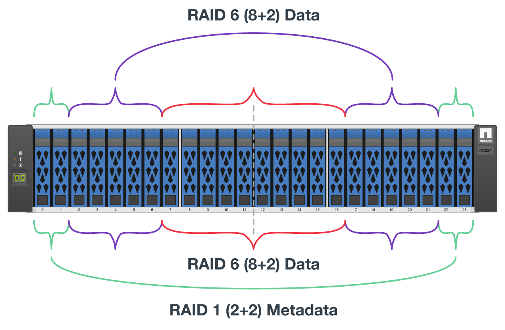

= Ponga en marcha el hardware
:hardbreaks:
:allow-uri-read: 
:nofooter: 
:icons: font
:linkattrs: 
:imagesdir: ./media/

[role="lead"]
Cada elemento básico consta de dos nodos de archivos x86 validados conectados directamente a dos nodos de bloque mediante cables InfiniBand HDR (200 GB).

NOTE: Debido a que cada bloque de creación incluye dos nodos de archivo BeeGFS, se requiere un mínimo de dos bloques de construcción para establecer el quórum en el clúster de conmutación por error. Si bien es posible configurar un clúster de dos nodos, existen limitaciones en esta configuración que pueden evitar que se produzca una conmutación al respaldo correcta en algunos casos. Si se requiere un clúster de dos nodos, también es posible incorporar un tercer dispositivo como tiebreaker, aunque este procedimiento no se contempla.

A menos que se indique lo contrario, los pasos siguientes son idénticos para cada bloque de creación del clúster independientemente de si se utiliza únicamente para ejecutar metadatos y servicios de almacenamiento o servicios de almacenamiento de BeeGFS.

.Pasos
. Configure cada nodo de archivo BeeGFS con cuatro adaptadores de canal host (HCA) de doble puerto PCIe 4.0 ConnectX-6 en modo InfiniBand e instálelos en las ranuras PCIe 2, 3, 5 y 6.
. Configure cada nodo de bloque BeeGFS con una tarjeta de interfaz del host (HIC) de 200 GB de puerto doble e instale la HIC en cada una de sus dos controladoras de almacenamiento.
+
Monte en rack los bloques de creación de forma que los dos nodos de archivo BeeGFS se encuentren por encima de los nodos de bloque BeeGFS. La siguiente figura muestra la configuración de hardware correcta para el bloque de creación BeeGFS (vista trasera).

+
image:../media/buildingblock.png[""]

+

NOTE: La configuración de la fuente de alimentación para los casos de uso de producción normalmente debe utilizar fuentes de alimentación redundantes.

. Si es necesario, instale las unidades en cada uno de los nodos de bloque BeeGFS.
+
.. Si se va a utilizar el bloque de creación para ejecutar metadatos y servicios de almacenamiento de BeeGFS y unidades más pequeñas para volúmenes de metadatos, compruebe que estén ocupados en las ranuras de unidad más externas, como se muestra en la siguiente figura.
.. Para todas las configuraciones de bloques de construcción, si un compartimento de unidades no está completamente cargado, asegúrese de que se llena un mismo número de unidades en las ranuras 0–11 y 12–23 para obtener un rendimiento óptimo.
+

. Para cablear los nodos de archivos y bloques, utilice cables de cobre de conexión directa HDR de 1 m para que coincidan con la topología que se muestra en la siguiente figura.
+
image:../media/directattachcable.png[""]

+

NOTE: Los nodos de varios elementos básicos nunca están conectados directamente. Cada bloque se debe tratar como una unidad independiente y toda la comunicación entre los bloques de construcción se produce a través de conmutadores de red.

. Utilice 2 m (o la longitud adecuada) InfiniBand HDR 200 GB cables de cobre de conexión directa para conectar los puertos InfiniBand restantes de cada nodo de archivo a los switches InfiniBand que se usarán para la red de almacenamiento.
+
Si hay switches InfiniBand redundantes en uso, conecte los puertos resaltados en verde claro en la siguiente figura a switches diferentes.

+
image:../media/networkcable.png[""]

. Según sea necesario, monte elementos básicos adicionales siguiendo las mismas directrices de cableado.
+

NOTE: El número total de elementos básicos que se pueden poner en marcha en un único rack depende de la alimentación y la refrigeración disponibles en cada sitio.

