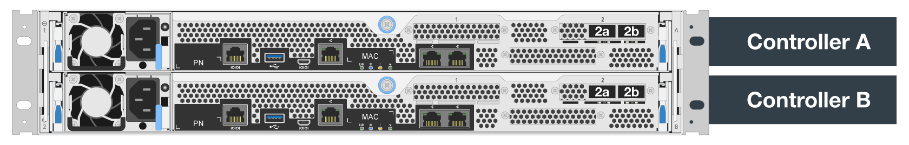

= Configuración de software
:hardbreaks:
:allow-uri-read: 
:nofooter: 
:icons: font
:linkattrs: 
:imagesdir: ./media/

[role="lead"]
La configuración de software de BeeGFS en NetApp incluye componentes de red BeeGFS, nodos de bloque EF600, nodos de archivos BeeGFS, grupos de recursos y servicios BeeGFS.

== Configuración de red BeeGFS

La configuración de red BeeGFS consta de los siguientes componentes.

* *IP flotantes* las IP flotantes son un tipo de dirección IP virtual que se puede enrutar dinámicamente a cualquier servidor de la misma red. Varios servidores pueden tener la misma dirección IP flotante, pero sólo puede estar activa en un servidor en un momento dado.
+
Cada servicio de servidor BeeGFS tiene su propia dirección IP que puede moverse entre nodos de archivo en función de la ubicación de ejecución del servicio de servidor BeeGFS. Esta configuración de IP flotante permite que cada servicio conmute por error de manera independiente al otro nodo de archivo. El cliente simplemente necesita conocer la dirección IP de un servicio BeeGFS concreto; no necesita saber qué nodo de archivo está ejecutando ese servicio en ese momento.

* *Configuración de hosts múltiples del servidor BeeGFS* para aumentar la densidad de la solución, cada nodo de archivo tiene varias interfaces de almacenamiento con IP configuradas en la misma subred IP.
+
Es necesario configurar más para asegurarse de que esta configuración funciona de la forma esperada con el paquete de redes de Linux, ya que, de forma predeterminada, es posible responder las solicitudes a una interfaz en otra interfaz si sus IP se encuentran en la misma subred. Además de otros inconvenientes, este comportamiento predeterminado hace que sea imposible establecer o mantener correctamente las conexiones RDMA.

+
La puesta en marcha basada en Ansible gestiona el apriete del comportamiento de la ruta inversa (RP) y del protocolo de resolución de direcciones (ARP), junto con la garantía de cuándo se inician y se detienen las IP flotantes; las reglas y rutas IP correspondientes se crean de forma dinámica para permitir que la configuración de red de múltiples hosts funcione correctamente.

* *Configuración multi-rail de cliente BeeGFS* _Multi-rail_ se refiere a la capacidad de una aplicación para utilizar múltiples “rieles” de red independientes para aumentar el rendimiento.
+
Si bien BeeGFS puede utilizar RDMA para la conectividad, BeeGFS utiliza IPoIB para simplificar la detección y establecimiento de conexiones RDMA. Para permitir que los clientes BeeGFS utilicen varias interfaces InfiniBand, puede configurar cada cliente con una dirección IP ubicada en una subred diferente y, a continuación, configurar las interfaces preferidas para la mitad de los servicios de servidor BeeGFS en cada subred.

+
En el siguiente diagrama, las interfaces resaltadas en verde claro se encuentran en una subred IP (por ejemplo, `100.127.0.0/16`) y las interfaces de color verde oscuro se encuentran en otra subred (por ejemplo, `100.128.0.0/16`).

+
En la siguiente figura se muestra el equilibrio del tráfico en varias interfaces de cliente BeeGFS.

+
image:../media/beegfs-design-image8.png[""]

+
Debido a que cada archivo de BeeGFS suele estar segado en múltiples servicios de almacenamiento, la configuración multicanal permite al cliente conseguir un mayor rendimiento del que es posible con un único puerto InfiniBand. Por ejemplo, el siguiente ejemplo de código muestra una configuración común de segmentación de archivos que permite al cliente equilibrar el tráfico entre ambas interfaces:

+
....
root@ictad21h01:/mnt/beegfs# beegfs-ctl --getentryinfo myfile
Entry type: file
EntryID: 11D-624759A9-65
Metadata node: meta_01_tgt_0101 [ID: 101]
Stripe pattern details:
+ Type: RAID0
+ Chunksize: 1M
+ Number of storage targets: desired: 4; actual: 4
+ Storage targets:
  + 101 @ stor_01_tgt_0101 [ID: 101]
  + 102 @ stor_01_tgt_0101 [ID: 101]
  + 201 @ stor_02_tgt_0201 [ID: 201]
  + 202 @ stor_02_tgt_0201 [ID: 201]
....
+
El uso de dos subredes IPoIB es una distinción lógica. Puede usar una sola subred InfiniBand física (red de almacenamiento) si lo desea.

+

NOTE: Se ha añadido soporte multi-rail en BeeGFS 7.3.0 para permitir el uso de múltiples interfaces IB en una única subred de IPoIB. El diseño de BeeGFS en la solución de NetApp se desarrolló antes de la disponibilidad general de BeeGFS 7.3.0, por lo que se demuestra el uso de dos subredes IP para usar dos interfaces IB en los clientes BeeGFS. Una ventaja del método de subred IP múltiple es que se elimina la necesidad de configurar el modo de multicentrado en los nodos cliente de BeeGFS (para obtener más información, consulte https://doc.beegfs.io/7.3.0/advanced_topics/rdma_support.html["Soporte para RDMA BeeGFS"^]).

== Configuración de nodos de bloques de EF600

Los nodos de bloques constan de dos controladoras RAID activo/activo con acceso compartido al mismo conjunto de unidades. Por lo general, cada controladora tiene la mitad de los volúmenes configurados en el sistema, pero puede sustituir la otra controladora según sea necesario.

El software multivía en los nodos de archivos determina la ruta activa y optimizada para cada volumen y se mueve automáticamente a la ruta alternativa en caso de que se produzca un fallo en un cable, un adaptador o una controladora.

El siguiente diagrama muestra el diseño de la controladora en los nodos de bloques de EF600.

Para facilitar la solución de alta disponibilidad de disco compartido, los volúmenes se asignan a los dos nodos de archivo para que puedan hacerse cargo entre sí según sea necesario. En el siguiente diagrama se muestra un ejemplo de cómo se configura el servicio BeeGFS y la propiedad de volumen preferida para obtener el máximo rendimiento. La interfaz a la izquierda de cada servicio BeeGFS indica la interfaz preferida que los clientes y otros servicios utilizan para ponerse en contacto con él.

image:../media/beegfs-design-image10.png[""]

En el ejemplo anterior, los clientes y los servicios de servidor prefieren comunicarse con el servicio de almacenamiento 1 mediante la interfaz i1b. El servicio de almacenamiento 1 utiliza la interfaz i1a como ruta preferida para comunicarse con sus volúmenes (Storage_tgt_101, 102) en la controladora A del primer nodo de bloque. Esta configuración hace uso del ancho de banda PCIe bidireccional completo disponible para el adaptador InfiniBand y logra un mejor rendimiento a partir de un adaptador HDR InfiniBand de doble puerto del que sería posible con PCIe 4.0 de otro modo.

== Configuración de nodos de archivos BeeGFS

Los nodos de archivos BeeGFS se configuran en un clúster de alta disponibilidad para facilitar la conmutación por error de los servicios BeeGFS entre varios nodos de archivos.

El diseño de clúster de alta disponibilidad se basa en dos proyectos de alta disponibilidad de Linux ampliamente utilizados: Corosync para la pertenencia a clústeres y Pacemaker para la administración de recursos de clúster. Para obtener más información, consulte https://access.redhat.com/documentation/en-us/red_hat_enterprise_linux/8/html/configuring_and_managing_high_availability_clusters/assembly_overview-of-high-availability-configuring-and-managing-high-availability-clusters["Formación de Red Hat para complementos de alta disponibilidad"^].

NetApp es autor y creó varios agentes de recursos de marco de clúster abierto (OCF) ampliados para permitir que el clúster inicie y supervise de forma inteligente los recursos de BeeGFS.

== Clústeres de alta disponibilidad de BeeGFS

Normalmente, cuando se inicia un servicio BeeGFS (con o sin ha), deben existir algunos recursos:

* Direcciones IP donde se puede acceder al servicio, generalmente configuradas por Network Manager.
* Sistemas de archivos subyacentes utilizados como objetivos para BeeGFS para almacenar datos.
+
Normalmente se definen en `/etc/fstab` Y montado por systemd.

* Servicio de sistema responsable de iniciar los procesos de BeeGFS cuando los otros recursos están listos.
+
Sin software adicional, estos recursos solo comienzan en un único nodo de archivo. Por lo tanto, si el nodo de archivo se desconecta, una parte del sistema de archivos BeeGFS no está accesible.

Debido a que varios nodos pueden iniciar cada servicio BeeGFS, Pacemaker debe asegurarse de que cada servicio y los recursos dependientes sólo se ejecutan en un nodo cada vez. Por ejemplo, si dos nodos intentan iniciar el mismo servicio BeeGFS, existe el riesgo de que se dañen los datos si ambos intentan escribir en los mismos archivos en el destino subyacente. Para evitar esta situación, Pacemaker confía en Corosync para mantener de forma fiable el estado general del clúster sincronizado entre todos los nodos y establecer quórum.

Si se produce un fallo en el clúster, Pacemaker reacciona y reinicia los recursos de BeeGFS en otro nodo. En algunos casos, es posible que Pacemaker no pueda comunicarse con el nodo defectuoso original para confirmar que los recursos están detenidos. Para verificar que el nodo está inactivo antes de reiniciar los recursos de BeeGFS en otra parte, Pacemaker apaga el nodo defectuoso, lo que es ideal para eliminar la alimentación.

Hay muchos agentes de esgrima de código abierto disponibles que permiten a Pacemaker cercar un nodo con una unidad de distribución de energía (PDU) o utilizando el controlador de administración de placa base del servidor (BMC) con API como Redfish.

Cuando BeeGFS se ejecuta en un clúster ha, Pacemaker gestiona todos los servicios BeeGFS y los recursos subyacentes en grupos de recursos. Cada servicio BeeGFS y los recursos de los que depende, se configuran en un grupo de recursos, que garantiza que los recursos se inician y se detienen en el orden correcto y se encuentran en el mismo nodo.

Para cada grupo de recursos BeeGFS, Pacemaker ejecuta un recurso de supervisión BeeGFS personalizado que es responsable de detectar condiciones de fallo y de activar de forma inteligente recuperaciones tras fallos cuando un servicio BeeGFS ya no está accesible en un nodo concreto.

La siguiente figura muestra los servicios y dependencias de BeeGFS controlados por marcapasos.

image:../media/beegfs-design-image11.png[""]

NOTE: De modo que se inician varios servicios BeeGFS del mismo tipo en el mismo nodo, Pacemaker se configura para iniciar servicios BeeGFS mediante el método de configuración Multi Mode. Para obtener más información, consulte https://doc.beegfs.io/latest/advanced_topics/multimode.html["Documentación de BeeGFS sobre modo múltiple"^].

Debido a que los servicios BeeGFS deben poder iniciarse en varios nodos, el archivo de configuración de cada servicio (normalmente ubicado en `/etc/beegfs`) Se almacena en uno de los volúmenes E-Series utilizados como objetivo BeeGFS para ese servicio. Esto hace que la configuración junto con los datos de un servicio BeeGFS en particular sea accesible para todos los nodos que puedan necesitar ejecutar el servicio.

....
# tree stor_01_tgt_0101/ -L 2
stor_01_tgt_0101/
├── data
│   ├── benchmark
│   ├── buddymir
│   ├── chunks
│   ├── format.conf
│   ├── lock.pid
│   ├── nodeID
│   ├── nodeNumID
│   ├── originalNodeID
│   ├── targetID
│   └── targetNumID
└── storage_config
    ├── beegfs-storage.conf
    ├── connInterfacesFile.conf
    └── connNetFilterFile.conf
....